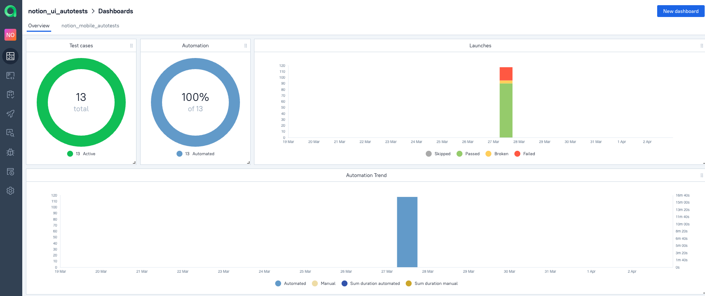
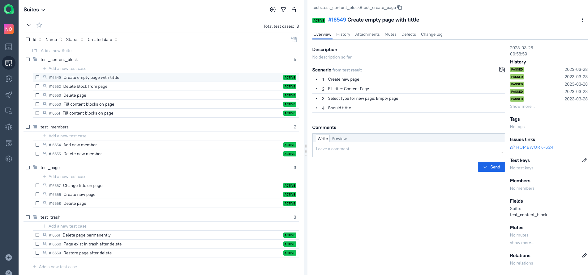
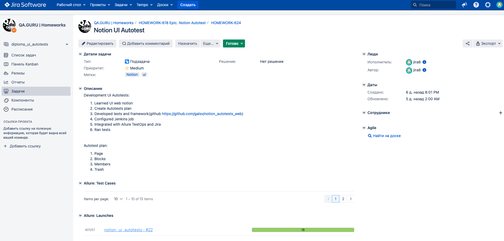

## Test UI automation project for Notion

  

Notion is a freemium productivity and note-taking web application developed by Notion Labs Inc. It offers organizational tools including task management, project tracking, to-do lists, bookmarking, and more.

<!-- Technology -->

### Tools and a technologies

  <code></code>
  <code></code>
  <code></code>
  <code></code>
  <code></code>
  <code></code>
  <code></code>
  <code></code>
  <code></code>
  <code></code>

<!-- Тest Case -->

### Test cases
* Create/Delete page
* Change page title
* Create/Update/Delete block
* Add/Remove member
* Restore/Permanently delete from trash 

<!-- Jenkins -->

###  Run in Jenkins
### [Job](https://jenkins.autotests.cloud/job/notion_ui_autotests/)
##### Main page of the build:

##### After the build is done the test results are available in Allure Report and Allure TestOps

<!-- Allure report -->

###  Allure report
##### Main page of Allure report contains the following blocks:

>- <code><strong>*ALLURE REPORT*</strong></code> - displays date and time of the test, overall number of launched tests,
>- <code><strong>*TREND*</strong></code> - displays trend of running tests for all runs
>- <code><strong>*SUITES*</strong></code> - displays distribution of tests by suites
>- <code><strong>*CATEGORIES*</strong></code> - displays distribution of unsuccessful tests by defect types

##### On the page the list of the tests grouped by suites with status shown for each test. Full info about each test can be shown: tags, severity, duration, detailed steps.

##### Test run clip

<!-- Allure TestOps -->

###  Allure TestOps Integration
### [Dashboard](https://allure.autotests.cloud/project/2086/dashboards)
##### Results are uploaded there and the automated test-cases can be automatically updated accordingly to the recent changes in the code.

Test-cases in the project are imported and constantly updated from the code,
so there is no need in complex process of synchronization manual test-cases and autotests.\
It is enough to create and update an autotest in the code and the test-case in TMS always will be in actual state.\
Manual test-cases also can be added in TMS in case of need(via web interface or via code).

<!-- Jira -->

###  Jira integration
##### After configuration TestOps we can integrate results launches in Jira

<!-- Telegram -->

###  Telegram Notifications
##### Telegram bot sends a brief report to a specified telegram chat by results of each build.

